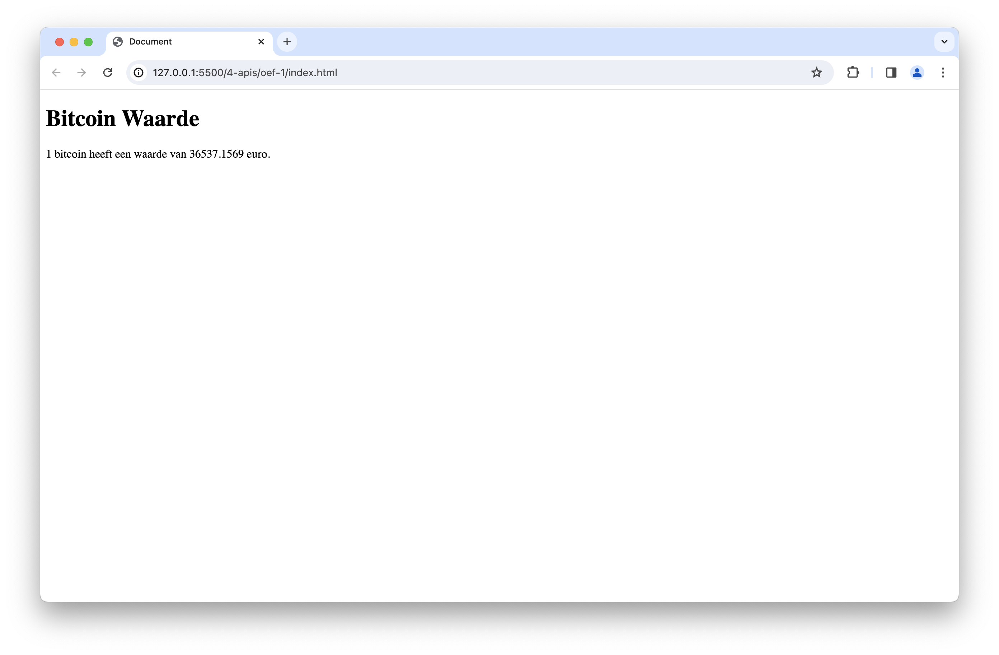
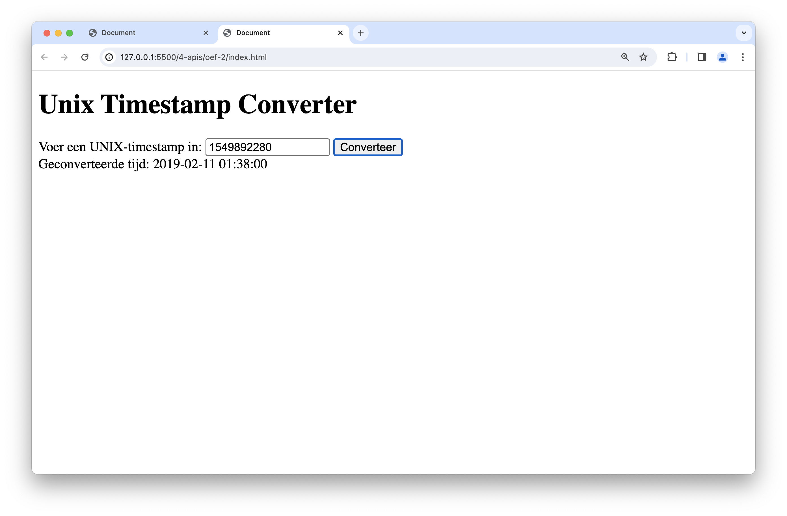
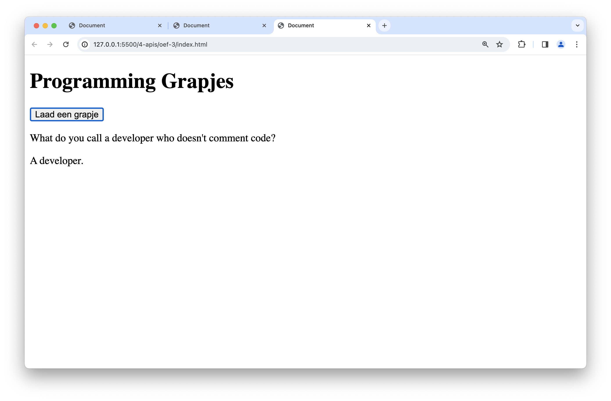
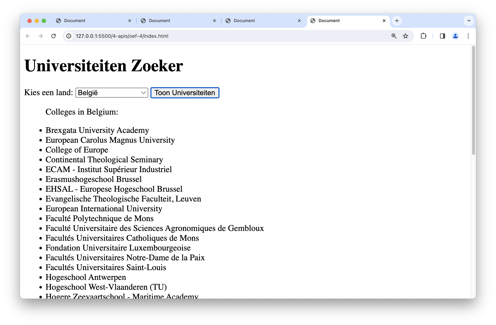
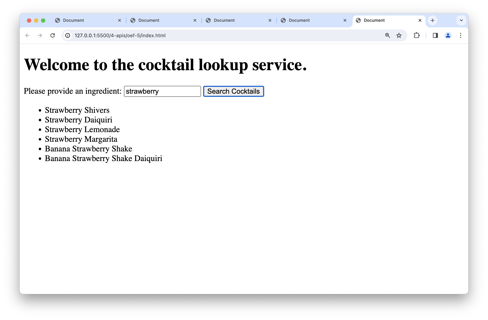

# Labo 21

Zorg dat je de volgende folderstructuur volgt:

```text
webtechnologie/
├─ labo-01/
│  ├─ oefening-01/
│  │  ├─ index.html
│  │  ├─ images/
│  │  │  ├─ image-1.jpg 
│  │  │  └─ image-n.jpg 
│  │  ├─ css/
│  │  │   ├─ reset.css
│  │  │   └─ style.css
│  │  └─ js/
│  │     └─ script.js
│  ├─ oefening-02/
│  └─ oefening-n/
├─ labo-02/
└─ labo-n/      
```

- Gebruik steeds JS modules om globale variabelen te vermijden (`<script type="module" src="./path/to/script.js"></script>`)
- Volg de [Coding Guidelines](https://apwt.gitbook.io/webtechnologie/coding-guidelines)

## oefeningen Postman

### oefening 1: basis api request

#### Leerdoelen

* Verkenning van het maken van een eenvoudig GET-verzoek naar een openbare API.

#### Functionele analyse

1. **API:** [**JSONPlaceholder**](https://jsonplaceholder.typicode.com/)
2. Endpoint: `/posts`
3. Doel: Haal alle berichten op.

#### Technische analyse

1. Open Postman.
2. Maak een nieuw verzoek naar de API.
3. Gebruik de endpoint `/posts`.
4. Voer het verzoek uit en bekijk de JSON-respons.

### oefening 2: query parameters

#### Leerdoelen

* Werken met query parameters bij een API-verzoek.

#### Functionele analyse

1. **API:** [**PokeAPI**](https://pokeapi.co)
2. Endpoint: `/generation`
3. Doel: Haal generatie 1 uit Pokémon op.

#### Technische analyse

1. Maak een nieuw verzoek naar de API.
2. Gebruik de endpoint `/generation`.
3. Voeg de query parameter `id` toe voor de eerste generatie.
4. Voer het verzoek uit en analyseer de respons.

### oefening 3: post-verzoek

#### Leerdoelen

* Een POST-verzoek maken.

#### Functionele analyse

1. **API:** [**JSONPlaceholder**](https://jsonplaceholder.typicode.com/)
2. Endpoint: `/posts`
3. Doel: Maak een nieuw bericht aan.

#### Technische analyse

1. Maak een nieuw verzoek naar de API.
2. Gebruik de endpoint `/posts`.
3. Stel de body in als raw JSON met de benodigde gegevens.
4. Voer het verzoek uit en controleer of het nieuwe bericht is toegevoegd.

## oefening 4: authenticatie met api key

#### Leerdoelen

* Gebruik van een API-sleutel voor toegang.

#### Functionele analyse

1. **API:** [**News API**](https://newsapi.org/)
2. Endpoint: `/top-headlines`
3. Doel: Haal nieuws op met een API-sleutel.

#### Technische analyse

1. Maak een nieuw verzoek naar de API.
2. Gebruik de endpoint `/top-headlines`.
3. Voeg een `X-Api-Key` header toe met je API-sleutel.
4. Voer het verzoek uit en bekijk de respons.

## Oefeningen `fetch`

**Bekijk bij elke oefening de API eerst via Postman!**

### oefening 5: Bitcoin waarde

#### Leerdoelen

* Kennismaking met de Fetch API
* Weergeven van gegevens in de DOM

#### Functionele analyse

Lees een API uit die de actuele waarde in euro geeft van 1 Bitcoin en toon deze waarde in de DOM.

#### Technische analyse

1. Gebruik de `fetch`-functie om gegevens op te halen van de API: [https://sampleapis.assimilate.be/bitcoin/current](https://sampleapis.assimilate.be/bitcoin/current).
2. Haal de actuele waarde van 1 Bitcoin (bpi.EUR.rate\_float) uit het responsobject.
3. Toon deze waarde in de DOM.

#### Voorbeeldinteractie



### oefening 6: Unix timestamp converter

#### Leerdoelen

* Gebruik van de Fetch API
* Weergeven van gegevens in de DOM
* Werken met invoer van de gebruiker

#### Functionele analyse

Maak gebruik van een API die een UNIX-timestamp als input krijgt en onze datum/uur notatie teruggeeft. Toon de geconverteerde tijd in de DOM.

#### Technische analyse

1. Gebruik de `fetch`-functie om gegevens op te halen van de API: [https://helloacm.com/api/unix-timestamp-converter/?cached\&s=1451613802](https://helloacm.com/api/unix-timestamp-converter/?cached\&s=1451613802).
2. Vraag de gebruiker om een UNIX-timestamp in te voeren.
3. Voeg de ingevoerde timestamp toe aan de API-url.
4. Toon het geconverteerde tijdstip in de DOM.

#### Voorbeeldinteractie



### oefening 7: programmeergrapjes

#### Leerdoelen

* Gebruik van de Fetch API
* Weergeven van gegevens in de DOM
* Interactie met de gebruiker

#### Functionele analyse

Toon programmeergrapjes aan de gebruiker en laat ze kiezen of ze meer grapjes willen zien.

#### Technische analyse

1. Gebruik de `fetch`-functie om gegevens op te halen van de API: [https://v2.jokeapi.dev/joke/Programming?type=twopart](https://v2.jokeapi.dev/joke/Programming?type=twopart).
2. Toon de setup en delivery van het grapje in de DOM.
3. Vraag de gebruiker of ze meer grapjes willen zien.

#### Voorbeeldinteractie



### oefening 8: universiteitenzoeker

#### Leerdoelen

* werken met objecten en JSON-gegevens
* gebruik van de Fetch API in een frontend-omgeving
* dynamisch bijwerken van de DOM

#### Functionele analyse

Laat de gebruiker een land kiezen uit een lijst van landen. Op basis van de keuze toon je de hogescholen/universiteiten uit dat land in de website. De gebruiker kan doorgaan met het selecteren van landen zolang hij of zij dat wenst.

#### Technische analyse

1. Maak een HTML-pagina met een dropdown voor het kiezen van een land, een knop om universiteiten op te halen, en een lijst om de resultaten weer te geven.
2. Gebruik de `fetch`-functie om gegevens op te halen van de API: [http://universities.hipolabs.com/search?country=Netherlands](http://universities.hipolabs.com/search?country=Netherlands).
3. Haal het geselecteerde land op uit de dropdown.
4. Toon de universiteiten uit het geselecteerde land in de lijst op de website.
5. Laat de gebruiker herhaaldelijk landen kiezen zolang hij of zij dat wenst.
6. Toon de resultaten dynamisch in de DOM.

#### Voorbeeldinteractie



### oefening 9: cocktails

#### Leerdoelen

* Werken met objecten
* Dot notatie gebruiken
* Gebruik/uitlezen van JSON
* Schrijven van functies
* Gebruik maken van Async/Await

#### Functionele analyse

Probeer nu met de opgedane kennis uit de voorgaande oefeningen zelf een cocktail lookup service te scripten. Baseer je hiervoor op onderstaande voorbeeldinteractie.

#### Technische analyse

Je maakt hiervoor gebruik van de volgende api-url:

```js
https://www.thecocktaildb.com/api/json/v1/1/search.php?s=kiwi
```

Bovenstaande URL zoekt naar alle cocktails met kiwi als ingrediënt.

> **Opgelet:** Voor deze fetch-api call zal je ook nog extra header info moeten meegeven. Dat doe je door bij de `fetch`-methode de 2e parameter in te stellen:
>
> ```js
> fetch(
>   apiUrl,
>   {
>     headers: { "Accept-Encoding": "gzip,deflate,compress" }
>   }
> )
> ```

#### Voorbeeldinteractie


